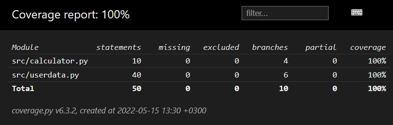

# Testausdokumentti

Ohjelmaa on testattu automatisoiduilla unittesteilla sekä manuaalisesti käyttöliittymän kautta.

## Automatisoidut testit

### Tietokanta
Tietokannasta vastaava `Userdata`-luokka testataan [TestUserdata](calorie_counter/src/tests/userdata_test.py)-testiluokalla. Testit alustettiin siten että jokaisessa testissä on uusi tietokanta, jossa on kaikki taulut. Testien aikana tauluihin lisätään ja niistä haetaan tietoa. Testeissä suoritettiin myös päiväämäärien oikeellinen toiminta.

### Laskin
Laskemista vastaava luokka `Calculator`-luokka testataan [TestCalculator](calorie_counter/src/tests/calculator_test.py)-testiluokalla. Testissä alustetaan `Calculator`-luokka jolle annetaan eri malli ihmisten tiedot laskettavaksi.

### Testikattavuus
Käyttöliittymää lukuunottamatta sovelluksen testien haaraumakattavuus on 100%.

## Järjestelmätestaus
Sovellus on testattus manuaalisesti.

### Asennus

Sovellus on testattu [käyttöohjeen](./kayttoohje.md) mukaisesti Linux-ympäristössä. Testauksessa on tarkistettu komentoijen oikea toiminnallisuus. Ohjeissa on näytetty komentojen suoritus järjestys.

## Sovellukseen jääneet laatuongelmat

Sovellusta testatesssa olemassa oleva tietokanta poistetaan, jolloin käyttäjän mahdollisesti tallentamat tiedot poistetaan samalla. 
