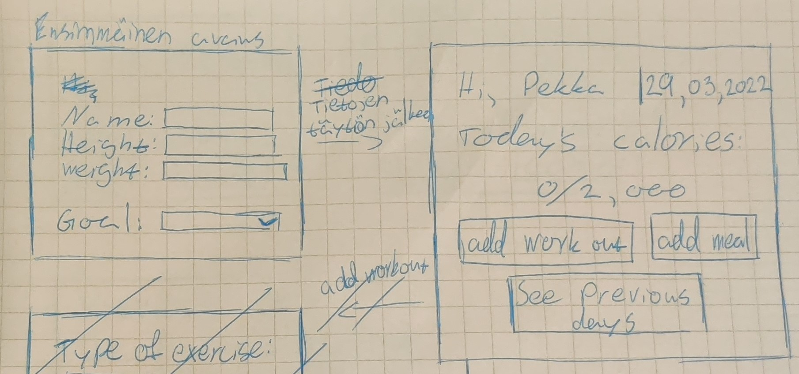
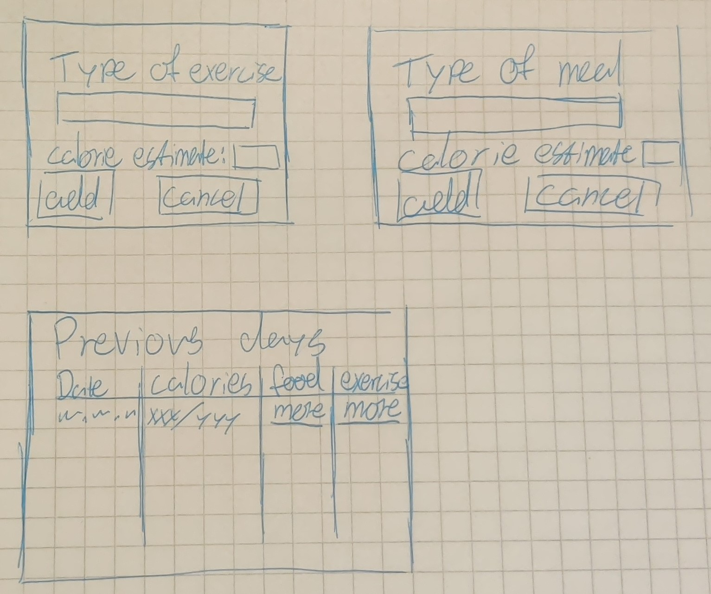

# Vaatimusmäärittely

## Sovelluksen tarkoitus

Sovelluksen tarkoitus on pitää kirjaa käyttäjän kalorimääristä. Sovellukseen kirjataan mitä päivän aikana käyttäjä syö ja mitä urheilua on tehty.
Tietojen perusteella sovellus laskee käyttäjän päivittäisen kalorien polton. Käyttäjä voi asettaa itselleen päivittäisen kaloritavoitteen.

## Käyttäjät

Sovellukseen on tarkoitus luoda vain yksi käyttäjä ensimmäisella aukaisukerralla. Myöhemmin sovellukseen saatetaan lisätä mahdollisuus luoda uusia käyttäjiä ja/tai 
_valmentaja_ käyttäjä, joka voi tarkastella muiden käyttäjien kaloreita.

## Käyttöliittymäluonnos
Sovelluksessa on viisi ikkunaa. Yksi ensimmäiselle avaukselle missä täytetään käyttäjän tiedot, mistä pääsee yleisnäkymään. Yleisnäkymässä käyttäjälle näytetään kaloritavoite ja siinä voi lisätä treenin, ruuan tai nähdä aikaisemmat päivät. 

Yleisnäkymästä voidaan mennä treeninäkymaan, ruokanäkymään tai aikaisempien päivien näkymään. Treeninäkymässä pitää kirjoittaa millainen treeni on tehty ja kuinka paljon kaloreita on käytetty minkä jälkeen treeni voidaan lisätä tai päätös voidaan perua. Molemmat vievät käyttäjän takaisin yleisnäkymään. Ruokanäkymä toimii samoin tavoin kuink treeninäkymä mutta siihen kirjoitetaan mitä ollaan syöty ja kuinka paljon kaloreita ruuassa oli. Näkymästä palataan yleisnäkymään samalla tavalla kuin treeninäkymästä. Aikaisempien päivien näkymä näyttää taulukon aikaisempien päivien kaloritavoitteista.

## Perusversion tarjoama toiminnallisuus
### Ensimmäinen sovelluksen aukaisu
- Sovellus kysyy käyttäjän tiedot joilla lasketaan kalorien poltto "Tehty"
  - Tietoihin kuuluu esim. käyttäjän paino, pituus ja sukupuoli 
 
### Tietojen tallentamisen jälkeen
- Sovellus näyttää päivän kaloritavoitteen ja päivämäärän
  - Tavoitteen lisäksi näkyy myös kuinka monta kaloria on syöty päivän aikana "tehty"
- Käyttäjä voi lisätä syödyn ruuan  "Tehty"
  - Uudessa ikkunassa voidaan kirjoittaa mitä on syöty ja käyttäjä täyttää kaloriarvion
- Käyttäjä voi lisätä treenin  "Tehty"
  - Uudessa ikkunassa voidaan kirjoittaa miten on urheiltu ja käyttäjä täyttää kaloriarvion

## Jaktokehitysideoita
Perusversion jälkeen järjestelmää täydennetään ajan salliessa esim. seuraavilla toiminnallisuuksilla:
- Sovelluksessa on valmiiksi tallennettuja treenejä jotka voi valita ilman että käyttäjän tarvitsisi miettiä kaloreiden polttoa
- Sovellus muistaa aikaisempia harjoituksia ja ehdottaa niitä, kun käyttäjä lisää uuden treenin
- Sovelluksessa on valmiiksi tallennettuja ruokia jotka voi valita ilman että käyttäjän tarvitsis miettiä kuinka monta kaloria ruuassa oli
- Sovellus muistaa aikaisempia syötyjä ruokia ja ehdottaa niitä, kun käyttäjä lisää uuden ruokailun
- Sovellus laskee myös mitä vitamiineja syödystä ruoasta on saatu
- Sovellus laskee kuinka paljon proteiinia ruuasta on saatu joka päivä
- Sovellus voi antaa viikottaisen arvion/kokoelman viikon tavoitteiden täytöstä
- Sovellukseen voi myös asettaa harjoittelu tavoitteita kalori tavoitteen lisäksi
- Käyttäjä voi valita tarkemmin erilaisia kaloritavoitteita
